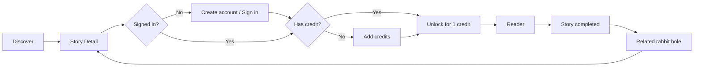
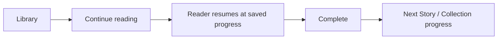
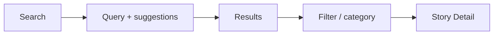
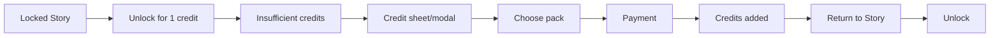

# Curiofold — Product Design Source of Truth
**Version:** 1.0  
**Status:** Design specification ready for technical planning and implementation  
**Date:** 2026-09-19  
**Audience:** Product owner, Codex / engineering, future designers, content operations  
**Working brand:** Curiofold — final legal/trademark/domain clearance still required  
**Figma:** https://www.figma.com/design/MMhGFEM4kfTa6lHrrGrA8g

---

## 0. Purpose of this document

This document is the complete product-design handoff for the Curiofold platform.

It consolidates:

1. The original product concept and business requirements.
2. The branding and visual system already created in Figma.
3. The remaining UX/UI work that could not be written to Figma because of the current Figma Starter MCP limits.
4. The complete information architecture, user flows, screen specifications, component system, responsive behavior, interaction rules, accessibility standards, content rules, commerce UX, reader UX, progress system, states, microcopy principles and implementation acceptance criteria.
5. Explicit product-design decisions that Codex can use as a stable base while it owns technical architecture, implementation and engineering project management.

This is a **product/design source of truth**, not an implementation architecture document.

Codex should treat the design decisions in this document as authoritative unless implementation constraints make a decision genuinely impossible. In that case, Codex should preserve the user outcome and surface the discrepancy rather than silently changing the experience.

---

# 1. Product definition

## 1.1 Original concept

Curiofold is a browser-based platform for short, compelling, deeply researched factual reads.

The original concept described each unit as a short PDF of up to roughly 10 pages. The product experience should **not present the item primarily as a “PDF”**. “PDF” is a file/production format; it weakens perceived value and makes the product feel like a file store.

The user-facing unit is a:

> **Story**

A Story is a concise, well-edited, credible piece of narrative non-fiction that makes an interesting topic enjoyable and understandable in approximately **5–10 minutes**.

Examples of subject areas:

- History
- Science
- Technology
- Sport
- Food
- Religion
- Space
- Culture
- Business
- Psychology
- Engineering
- Nature
- Medicine
- Geography
- Design

The catalogue is intentionally broad. The product is driven by **curiosity**, not by one academic discipline.

---

## 1.2 Core value proposition

> **Understand something fascinating in a few minutes, without falling into a two-hour research rabbit hole.**

Curiofold should give users:

- A strong reason to click.
- A clear expectation of reading time.
- Credible factual content.
- Human-quality storytelling.
- A beautiful reading experience.
- A sense of collecting and completing knowledge.
- A natural path from one curiosity to the next.

---

## 1.3 Product promise

Each Story should feel:

- Short enough to start immediately.
- Good enough to be worth paying for.
- Credible enough to trust.
- Beautiful enough to enjoy reading.
- Interesting enough to share or recommend.
- Connected enough to lead to another Story.

The platform should never feel like:

- A school textbook.
- A Wikipedia clone.
- A generic AI-content website.
- A PDF marketplace.
- A self-help book-summary application.
- A dashboard full of unnecessary metrics.

---

# 2. Brand system

## 2.1 Working name

# Curiofold

**Meaning:** curiosity + unfolding an idea/story.

The name supports the product concept of opening one compact piece of content and progressively discovering a larger world around it.

### Status

This is the **working brand selected for the design system**.

Before a public launch, complete:

- Formal trademark screening.
- Domain availability/ownership decision.
- Social handle screening.
- App/store conflicts if native products are ever considered.
- Relevant EU/Portuguese commercial-name checks.

Do not interpret the use of Curiofold in this specification as formal legal clearance.

---

## 2.2 Tagline

> **Small stories. Big rabbit holes.**

This is the primary brand line.

It communicates both the short format and the discovery loop.

Secondary language may use phrases such as:

- Follow your curiosity.
- One story can lead anywhere.
- Learn something worth knowing.
- Start with one question.
- Five minutes. One fascinating idea.

The primary tagline should remain the most consistent line.

---

## 2.3 Brand personality

Curiofold is:

- Curious
- Intelligent
- Editorial
- Approachable
- Precise
- Contemporary
- Calm
- Slightly playful
- Confident without sounding academic
- Premium without feeling expensive

Curiofold is **not**:

- Childish
- Loud
- Corporate
- Futuristic-for-the-sake-of-it
- “AI-looking”
- Gamified like a mobile game
- Academic or institutional
- Clickbait without substance

---

## 2.4 Visual direction

The chosen visual direction is:

> **Contemporary editorial product**

The UI should combine the clarity of a modern digital product with the warmth and reading quality of an independent magazine.

Core contrast:

- **Interface:** structured, sans-serif, functional.
- **Story:** literary, calm, editorial.

The platform should visibly change character when the user enters the Reader. The surrounding product UI becomes quieter so the Story becomes the focus.

---

# 3. Existing Figma work

The following foundations have already been created in the Figma file.

## 3.1 Figma file structure

Because the current Starter plan limits the file to three pages, the file is organized as:

### 00 · Brand & Foundations
Contains brand direction, color, typography and design foundations.

### 01 · Components & UX
Reserved for components, variants, interaction patterns and UX flows.

### 02 · Product Screens & Prototype
Reserved for desktop/mobile product screens and prototype flows.

---

## 3.2 Existing brand boards

Already created:

- Brand / Cover
- Initial logo mark
- Curiofold wordmark
- Primary tagline
- Short positioning copy
- Working-name/legal-clearance badge
- Foundations / Color
- Foundations / Typography

---

## 3.3 Existing logo direction

The current mark uses:

- A compact rounded-square container.
- Ultramarine as the dominant field.
- A folded-corner/fold motif.
- Acid-lime as the discovery signal.
- A small “curiosity dot”.

The symbol should communicate opening/unfolding/discovery rather than books, graduation caps, brains or generic spark icons.

Do not introduce a stereotypical AI sparkle as the primary brand mark.

---

# 4. Color system

## 4.1 Primitive colors already created

| Token | Value | Purpose |
|---|---:|---|
| `ink/950` | `#121318` | Primary dark ink |
| `ink/800` | `#252832` | Dark surface / secondary ink |
| `ink/600` | `#62656E` | Secondary text |
| `ink/300` | `#B6B8BD` | Muted text |
| `paper/0` | `#FFFFFF` | Elevated surface |
| `paper/50` | `#FFFDF8` | Soft surface |
| `paper/100` | `#F6F1E7` | Main warm page |
| `paper/200` | `#E9E1D3` | Borders / separators |
| `blue/500` | `#3656F5` | Primary action |
| `blue/600` | `#2943D6` | Primary hover/pressed |
| `lime/400` | `#C9F45C` | Curiosity/progress |
| `coral/500` | `#F2684A` | Warm editorial accent |
| `gold/500` | `#D9A441` | Warning/accent |
| `teal/500` | `#2D9C8F` | Success/completed |
| `violet/500` | `#8B6CEB` | Optional category accent |
| `red/500` | `#D95050` | Error/destructive |

---

## 4.2 Semantic colors already created

| Semantic token | Primitive |
|---|---|
| `bg/base` | `paper/100` |
| `bg/surface` | `paper/50` |
| `bg/elevated` | `paper/0` |
| `text/primary` | `ink/950` |
| `text/secondary` | `ink/600` |
| `border/subtle` | `paper/200` |
| `action/primary` | `blue/500` |
| `action/primary-hover` | `blue/600` |
| `action/on-primary` | `paper/0` |
| `accent/curiosity` | `lime/400` |
| `accent/warm` | `coral/500` |
| `status/success` | `teal/500` |
| `status/warning` | `gold/500` |
| `status/error` | `red/500` |
| `focus/ring` | `blue/500` |

### Theme status

The design is currently **Light-first**.

The Figma Starter plan prevented the creation of multi-mode variable collections. Dark mode should not be treated as an MVP requirement merely because it is fashionable.

If implemented later, it should be designed deliberately rather than generated automatically.

---

# 5. Typography system

## 5.1 Interface typeface

**Instrument Sans**

Use for:

- Navigation
- Buttons
- Filters
- Search
- Metadata
- Story cards
- Wallet
- Account screens
- Progress
- System messages
- Headings outside the Reader

Reason: modern, clear and neutral enough to support a content-heavy product.

---

## 5.2 Editorial typeface

**Newsreader**

Use inside the Story reading experience for:

- Story title
- Body
- Pull quotes
- Editorial captions when appropriate

Reason: gives the Reader an intentional publishing/editorial character and clearly separates reading from navigation.

---

## 5.3 Existing Figma text styles

| Style | Typeface | Weight | Size / line height |
|---|---|---:|---:|
| `Display/XL` | Instrument Sans | Bold | 64 / 68 |
| `Heading/H1` | Instrument Sans | Bold | 40 / 44 |
| `Heading/H2` | Instrument Sans | SemiBold | 28 / 34 |
| `Body/Large` | Instrument Sans | Regular | 18 / 28 |
| `Body/Default` | Instrument Sans | Regular | 16 / 24 |
| `Body/Small` | Instrument Sans | Regular | 14 / 20 |
| `Label/Medium` | Instrument Sans | SemiBold | 14 / 18 |
| `Reader/Title` | Newsreader | SemiBold | 52 / 56 |
| `Reader/Body` | Newsreader | Regular | 20 / 32 |
| `Reader/Quote` | Newsreader | Italic | 24 / 36 |

Responsive scaling is defined later.

---

# 6. Spacing, radii and effects

## 6.1 Existing spacing variables

```text
space/1  = 4
space/2  = 8
space/3  = 12
space/4  = 16
space/5  = 20
space/6  = 24
space/8  = 32
space/10 = 40
space/12 = 48
space/16 = 64
space/20 = 80
```

Use the scale consistently. Avoid arbitrary values unless an optical correction is justified.

---

## 6.2 Existing radius variables

```text
radius/sm   = 8
radius/md   = 12
radius/lg   = 16
radius/xl   = 24
radius/full = 999
```

Guidance:

- Controls: 8–12
- Cards: 16
- Large feature surfaces: 24
- Pills/chips: full

---

## 6.3 Existing effect

`Shadow/Card`

Subtle elevation only. Curiofold should rely more on spacing, borders and surface contrast than on heavy shadows.

---

# 7. Product terminology

The following user-facing vocabulary is preferred.

| Avoid | Use |
|---|---|
| PDF | Story |
| PDF library | Library |
| Buy PDF | Unlock Story |
| Purchased PDFs | Your Stories |
| Document | Story |
| File | Story |
| Page progress | Reading progress |
| Product credits | Credits |
| Store | Discover |
| Marketplace | Discover |

Internal content tooling may continue to use PDF where technically relevant.

---

# 8. Commerce model in the UI

## 8.1 Core rule

> **1 Story = 1 credit**

The user should not be asked to perform a card payment for every €1 Story.

The experience should use a credit wallet.

Recommended initial packs:

| Pack | Price | Credits |
|---|---:|---:|
| Try it | €5 | 5 |
| Popular | €10 | 10 |
| Stock up | €20 | 20 |

Do not add fake discounts merely to manipulate conversion.

If commercial strategy later introduces bonuses, show them transparently.

---

## 8.2 Credit behavior

The balance is visible:

- In desktop navigation as a compact wallet pill.
- In mobile Account and, when relevant, in purchase surfaces.
- On locked Story Detail screens.

Examples:

`8 credits`

`1 credit`

Never show `8.00 credits`.

---

## 8.3 Unlock behavior

When user has at least one credit:

Primary CTA:

> **Unlock for 1 credit**

Secondary supporting text:

> Yours permanently in your Library.

The interaction should not require a full checkout if the user already owns credits.

Recommended confirmation behavior:

- First-ever unlock: small confirmation dialog to teach the model.
- Later unlocks: direct action + lightweight success feedback.
- Account setting can optionally enable “Always confirm before unlocking”.

---

# 9. Account policy

The original product requires an account to purchase and read.

The best UX interpretation is:

### Browsing
Anonymous users may:

- Browse Discover.
- Search.
- Filter.
- Open Story Detail.
- Read a short preview/description.

### Account required
Account required to:

- Purchase credits.
- Unlock a Story.
- Read full Stories.
- Save progress.
- Access Library.
- View purchase history.
- Use collection/progress features.

This reduces acquisition friction while preserving the original account requirement for owned content.

---

# 10. Information architecture

## 10.1 Top-level desktop navigation

Recommended order:

1. **Discover**
2. **Library**
3. **Collections**
4. Search
5. Credit balance
6. Account avatar/menu

Do not put every feature in the top navigation.

Secondary account features live inside Account.

---

## 10.2 Mobile navigation

Bottom navigation:

1. Discover
2. Search
3. Library
4. Progress

Account/avatar lives in the top-right area or inside Progress/Profile.

Wallet access appears in relevant purchase contexts and Account.

Reason: Search deserves a first-class mobile position because discovery is the core loop.

---

# 11. Core experience principles

## 11.1 Curiosity first

The first question is not:

> What category do you want to study?

It is:

> What looks too interesting not to open?

Titles, hooks and visual hierarchy should optimize for curiosity without becoming dishonest clickbait.

---

## 11.2 One obvious primary action

Each screen should have one dominant next step.

Examples:

- Home: open a Story.
- Locked Story Detail: unlock.
- Reader: continue reading.
- Completed Story: follow next rabbit hole.
- Empty Library: discover a Story.

---

## 11.3 Progressive disclosure

Do not overload Story cards.

Card = enough information to decide whether to inspect it.

Detail page = enough information to decide whether to unlock it.

Reader = content only.

---

## 11.4 Recognition over recall

Users should not need to remember:

- Their balance.
- Whether a Story is owned.
- Where they left off.
- Which category they were browsing.
- What “1 credit” means.

The UI should show context at the point of decision.

---

## 11.5 Preserve momentum

The main product loop should minimize dead ends:

**See → Want → Unlock → Read → Finish → Discover related Story**

Every completion surface must provide a meaningful next action.

---

# 12. Primary user flows

## 12.1 Core happy path



---

## 12.2 Returning reader



---

## 12.3 Search flow



---

## 12.4 Zero-credit flow



The user should return to the original Story after payment. Never make them find it again.

---

# 13. Desktop screen specifications

# 13.1 Discover / Home

## Goal
Get the user into an interesting Story quickly.

## Structure

### Header
- Curiofold logo
- Discover
- Library
- Collections
- Search
- Credit balance
- Avatar

### Hero
Preferred copy:

**What are you curious about today?**

Supporting line:

**Short, deeply researched stories about the things worth knowing.**

Hero should not consume the entire viewport. The user should see content immediately.

### Primary discovery modules

1. **For your next rabbit hole**
   - Personalized later.
   - Initially editorially curated.

2. **Trending now**
   - Based on real engagement data once available.
   - Before data exists, use “Popular this week” only if true.
   - Do not fake popularity.

3. **Explore by curiosity**
   Category chips or compact cards.

4. **Continue reading**
   Signed-in users with incomplete Stories only.

5. **New this week**
   Fresh catalogue entries.

6. **Collections**
   Curated sets such as:
   - The Roman Empire
   - Space disasters
   - Engineering mistakes
   - How food changed the world
   - Formula 1 secrets

### Grid
Desktop target:
- 4 columns on wide desktop.
- 3 columns on standard desktop/laptop.
- Avoid excessively narrow Story cards.

---

# 13.2 Category / Browse

## Header
`History`

Supporting text can be short and editorial, not SEO-heavy.

### Controls
- Search within category
- Topic/subcategory filters
- Reading time if later variable
- Ownership: All / Unlocked / Not unlocked
- Sort:
  - Recommended
  - Newest
  - Most read (only when real)

Filters should be visible or easily discoverable.

Active filters must be removable individually and with `Clear all`.

---

# 13.3 Search

## Empty/default state
Title:

**Search Curiofold**

Search suggestions can include:
- Popular searches
- Categories
- Recently viewed
- Editorial prompts

Example:
`Try “Roman Empire”, “F1 aerodynamics” or “space accidents”`

## Results
Show:
- Query
- Result count
- Story cards
- Related categories

## No results
Avoid a dead end.

Copy:

**No Story matches that yet.**

Then:
- Suggest nearby terms.
- Show relevant category.
- Offer “Explore all Stories”.

Future feature:
`Request this topic`

Not required for MVP.

---

# 13.4 Story card

A Story card is the most important discovery component.

## Mandatory information
- Visual/cover
- Category
- Title
- Short hook
- Reading time
- Ownership/progress state

## Purchase information
Locked:
`1 credit`

Owned:
`In your Library`

In progress:
`42% read`

Completed:
`Completed`

Do not display all states simultaneously.

## Recommended card anatomy

1. 16:10 or 4:3 image/illustration area.
2. Category label.
3. Strong title, max approximately 2–3 lines.
4. Short hook, max 2 lines.
5. Footer:
   - `7 min`
   - state or `1 credit`

### Hover
Desktop:
- Slight lift/border emphasis.
- Cover scale <= 1.02.
- No dramatic card animation.

Entire card should be clickable.

---

# 13.5 Story Detail — locked

## Purpose
Convert curiosity into an unlock without making the user feel they are entering a conventional ecommerce checkout.

### Left / main
- Category
- Story title
- Hook/subtitle
- Reading time
- Credibility signal
- Short description
- “What you’ll discover” — 3 bullets max
- Optional preview excerpt

### Right / purchase card
Sticky on desktop.

Contents:
- `1 credit`
- Current balance
- **Unlock for 1 credit**
- `Yours permanently in your Library`
- Secure-payment/wallet link when balance is low

### Credibility language
Use factual editorial language such as:

**Researched from credible published sources and editorially reviewed.**

Do not say “100% true” or “zero hallucinations” as a marketing claim.

### Preview
A preview may expose:
- Opening 1–2 paragraphs, or
- A deliberately written teaser.

Do not expose enough content that the paid experience feels unnecessary.

---

# 13.6 Story Detail — owned

Replace purchase panel with:

### Never started
**Start reading**

### In progress
**Continue reading · 42%**

### Completed
**Read again**

Secondary:
- Collection membership
- Related Stories

Ownership must be unmistakable.

---

# 13.7 Authentication

## Goal
Minimal interruption.

Supported initial modes:
- Sign in
- Create account
- Password recovery if password auth exists

If Codex chooses social auth technically, the visual system can accommodate it.

### Contextual auth
If authentication was triggered from an unlock:

Header:

**Create an account to keep this Story**

Then return the user to the same Story after auth.

Do not redirect to a generic dashboard.

---

# 13.8 Credit top-up

Can be a focused modal/sheet for simple purchase or a full page when needed for legal/payment requirements.

## Header
**Add credits**

Supporting line:
**1 credit unlocks 1 Story. Credits do not expire unless business/legal policy later specifies otherwise.**

Pack cards:
- €5 / 5 credits
- €10 / 10 credits
- €20 / 20 credits

One pack can be marked:
`Most popular`

Only as a merchandising recommendation, not a fake discount.

### Purchase CTA
`Continue to payment`

After success:

**10 credits added**

`Your balance is now 14 credits.`

If purchase started from a Story:

Primary CTA:
**Unlock “The night a computer nearly started World War III”**

---

# 13.9 Reader

The Reader is the highest-priority product experience after Discover.

## Reader philosophy

The reader should feel like:

> A calm, premium digital magazine article.

It should not look like:
- A PDF embed.
- Browser document viewer.
- Dashboard.
- E-book app with excessive controls.

---

## 13.9.1 Desktop Reader shell

### Top bar
Minimal.

Left:
- Back
- Curiofold mark or Story collection context

Center:
- Optional Story title, truncated

Right:
- Reading settings
- More/menu

### Progress
A thin persistent progress indicator at the top or immediately below the toolbar.

Do not display a large dashboard percentage while reading.

---

## 13.9.2 Reader content width

Recommended:
- Text column approximately 640–720 px on desktop.
- Maintain comfortable character length.
- Generous vertical spacing.
- Images may break wider than text when editorially useful.

### Reader type
Desktop default:
- Newsreader 20px
- 32px line height

Responsive rules later in this document.

---

## 13.9.3 Story structure

A Story may contain:

- Category eyebrow
- Title
- Subtitle/deck
- Reading-time metadata
- Hero visual
- Intro
- Section headings
- Body paragraphs
- Pull quote
- Inline image/diagram
- Fact box
- Source note / methodology note
- End matter

Do not force “10 PDF pages” into ten digital pages.

The web reading experience should be **continuous and responsive**.

If a PDF remains part of the publishing pipeline, it should not dictate the browser layout.

---

## 13.9.4 Reader settings

Keep simple:

- Text size: smaller / default / larger
- Optional reading width: standard / wide
- Theme only when a true dark/sepia mode is designed later

Avoid complex typography customization in MVP.

---

## 13.9.5 Progress behavior

Save progress automatically.

Suggested progress calculation should reflect meaningful Story consumption, not simply the current scroll pixel if that produces misleading jumps.

Design behavior:
- Return to approximately the last meaningful reading position.
- Show `Continue from 42%` before entering.
- Reader opens at saved position when requested.

Do not punish users if they scroll backwards.

Completion:
- Mark completed close to the actual end of the Story.
- Allow user to manually mark unread/read later if needed in Account/Library future iteration.

Exact engineering algorithm is Codex-owned.

---

# 13.10 Completion screen

Completion should feel rewarding without becoming childish.

## Content

Success marker:
**Story complete**

Title:
**You now know why that one decision mattered.**

Data:
- `8 min read`
- Collection progress, where applicable:
  `Cold War close calls · 2 of 7`

Primary:
**Follow the rabbit hole**

Show 2–4 highly relevant next Stories.

Secondary:
- Back to Library
- Share Story link
- Read again

Future:
- XP/achievement animation

MVP:
Keep reward subtle.

---

# 13.11 Library

## Goal
Make owned content feel valuable and easy to resume.

### Header
**Your Library**

Summary:
- Stories owned
- Completed
- In progress

Do not let metrics dominate.

### Tabs / filters
- All
- In progress
- Completed
- Unread

### Sorting
- Recently opened
- Recently unlocked
- Title
- Progress

### Story card
Owned card variant with progress.

Empty state:

**Your Library is waiting for its first rabbit hole.**

CTA:
**Discover Stories**

---

# 13.12 Collections

Collections are the bridge between discovery and gamification.

A Collection is an editorial grouping.

Examples:
- Roman Empire
- Cold War close calls
- F1 engineering
- Space disasters
- Food that changed history

### Collection card
Show:
- Name
- Short description
- `8 Stories`
- Progress if user owns/reads any:
  `3 of 8 completed`

### Collection detail
Header visual + description.

List Stories in curated order where sequence matters.

Locked Stories remain visible so the collection gives the user a reason to continue.

---

# 13.13 Progress

This can initially exist as a section within Profile/Collections rather than a separate desktop top-level screen if product complexity needs reduction.

Core visualization:

### Overall
`23 of 41 Stories completed`

### By category
Example:
- History — 12 completed
- Technology — 4
- Science — 3
- Sport — 4

### Collections
- Roman Empire — 8 / 8
- F1 Engineering — 5 / 12
- Space disasters — 2 / 9

The visual metaphor should feel like building a personal map/library of knowledge.

Avoid aggressive streak anxiety.

---

# 13.14 Account / Settings

Sections:

### Profile
- Name
- Email
- Language

### Reading
- Default text size
- Optional “Confirm before unlocking”

### Wallet
- Current credits
- Add credits
- Transaction/purchase history

### Content
- Library shortcut
- Reading progress

### Preferences
- Content language
- Newsletter/marketing consent as legally appropriate

### Security
- Password/auth options
- Sign out
- Delete account

### Legal
- Terms
- Privacy
- Refund/digital-content policy

---

# 14. Mobile design

Mobile is not a compressed desktop design.

It should be treated as a first-class reading/discovery environment.

Target minimum reference frame:
- 375–393 px width

Support smaller devices gracefully from approximately 320 px.

---

## 14.1 Mobile navigation

Bottom nav:
- Discover
- Search
- Library
- Progress

Top:
- Contextual title/logo
- Account/avatar where appropriate

When Reader is open, hide bottom navigation.

---

## 14.2 Mobile Discover

Order:
1. Compact header.
2. Search affordance.
3. Hero copy.
4. Horizontal category chips.
5. Continue reading, if present.
6. Curated Story sections.

Story cards:
- Primarily single-column or large horizontal cards.
- Avoid tiny two-column editorial cards unless proven readable.

---

## 14.3 Mobile Story Detail

Use vertical flow.

Hero → metadata → title/hook → preview → purchase panel.

The unlock CTA should become a sticky bottom action once the purchase block scrolls out of view.

Example:

`1 credit` | **Unlock**

Must account for safe-area inset.

---

## 14.4 Mobile credit purchase

Use bottom sheet for simple pack selection.

Payment-provider UI may transition externally or into a secure payment view depending on implementation.

After completion, restore the Story context.

---

## 14.5 Mobile Reader

Reader chrome should be extremely light.

- Top back button.
- Thin progress.
- Comfortable body width with 20–24 px horizontal margins.
- Default body around 19 px / 30 px.
- Reader controls available from one icon.
- Bars may reduce/hide while scrolling down and reappear on upward intent if technically stable and accessible.

Never hide navigation in a way that traps a user.

---

# 15. Responsive rules

Suggested product breakpoints:

```text
xs:  320–479
sm:  480–767
md:  768–1023
lg:  1024–1279
xl:  1280+
```

These are design ranges, not a mandated CSS framework.

## Page gutters

Suggested:
- xs: 20 px
- sm: 24 px
- md: 32 px
- lg: 48 px
- xl: 64–80 px

## Max content width
Main catalogue:
- approximately 1280–1360 px

Reader:
- body 640–720 px
- wider media can extend beyond

---

# 16. Typography responsive behavior

## Marketing/product display
`Display/XL`
- Desktop: 64/68
- Tablet: approximately 52/58
- Mobile: approximately 40/44

## H1
- Desktop: 40/44
- Mobile: 32/36

## Reader title
- Desktop: 52/56
- Mobile: approximately 38/42

## Reader body
- Desktop: 20/32
- Mobile: 19/30

Do not reduce reader body to conventional 16 px UI text.

---

# 17. Component system

Components should be built with Auto Layout, variables/tokens and variants where useful.

# 17.1 Button

Variants:
- Primary
- Secondary
- Ghost
- Destructive
- Icon

Sizes:
- Medium
- Large

States:
- Default
- Hover
- Pressed
- Focus
- Disabled
- Loading

Rules:
- Minimum visual height: 44 px.
- Prefer 48 px for primary commerce actions.
- Text labels should use verbs.

Good:
`Unlock for 1 credit`

Bad:
`Submit`

---

# 17.2 Icon button

Examples:
- Back
- Close
- Search
- Reader settings
- More

Target:
- Prefer 44 × 44 interaction area.
- Icon may be visually smaller.

Must have accessible label.

---

# 17.3 Story Card

Variants:
- Locked
- Owned unread
- In progress
- Completed
- Featured
- Compact/search
- Horizontal/mobile continuation

Properties:
- Category
- Title
- Hook
- Reading time
- Cover
- Progress
- Price/credit
- Status

---

# 17.4 Category Chip

States:
- Default
- Hover
- Selected
- Focus

Can include optional icon only if meaningful.

Selected state should not rely on color alone.

---

# 17.5 Filter Chip

Include:
- Label
- Optional value/count
- Remove icon when active

---

# 17.6 Search field

States:
- Empty
- Focused
- Typing
- Loading
- Results available
- No results
- Error

Desktop can support keyboard shortcut indicator later.

---

# 17.7 Credit balance pill

Example:
`◉ 8 credits`

Click:
- Opens wallet/top-up.

Low balance may subtly show:
`1 credit`

Do not use alarm/error styling for low balance.

---

# 17.8 Progress bar

Variants:
- Reader thin progress
- Card progress
- Collection progress

Progress must include accessible numeric text when needed, even when visually represented by a bar.

---

# 17.9 Progress ring

Use sparingly for profile/summary.

Do not use rings everywhere.

---

# 17.10 Modal / Dialog

Uses:
- First unlock confirmation
- Destructive confirmation
- Account/security

Must:
- Trap focus appropriately in implementation.
- Be dismissible when safe.
- Have clear primary/secondary hierarchy.

---

# 17.11 Bottom sheet

Mobile uses:
- Credit packs
- Reader settings
- Filters
- Lightweight actions

---

# 17.12 Toast

Use for non-blocking confirmations:

- `Story added to your Library`
- `10 credits added`
- `Reading preference updated`

Do not use toast for critical errors that require action.

---

# 17.13 Empty state

An empty state must provide:
1. What happened.
2. Why, when useful.
3. A next action.

---

# 17.14 Error state

Never blame the user.

Example:

**We couldn’t load this Story.**

`Your progress is saved. Try again.`

CTA:
`Retry`

Secondary:
`Back to Library`

---

# 17.15 Skeleton/loading

Use structural skeletons for:
- Story grids
- Story Detail
- Library

Reader loading should be fast and quiet.

Avoid indefinite spinning where a skeleton better preserves layout.

---

# 18. Interaction design

## 18.1 Motion principles

Motion should:
- Explain hierarchy.
- Confirm state changes.
- Preserve spatial context.
- Feel fast.

Suggested timings:
- Hover: 120–160 ms
- Small transition: 160–220 ms
- Sheet/modal: 220–300 ms

Respect `prefers-reduced-motion`.

No ornamental parallax in Reader.

---

## 18.2 Card hover

Desktop:
- Small translation/elevation.
- Border/fill emphasis.
- Image subtle scale.

Never move cards enough to cause layout instability.

---

## 18.3 Unlock

Sequence:
1. CTA pressed.
2. Brief loading state.
3. Credit deducts.
4. Ownership state updates.
5. Success feedback.
6. Primary CTA becomes `Start reading`.

Avoid confetti in normal unlock.

---

## 18.4 Completion

A subtle line/check animation is acceptable.

For future major achievements:
small celebratory motion may be used.

---

# 19. Content design

# 19.1 Story title strategy

Titles should communicate a concrete curiosity.

Preferred:
- **The 90 minutes that changed Chernobyl forever**
- **Why F1 cars spark — and why engineers want them to**
- **The day Rome was sold to the highest bidder**
- **How sushi went from street food to luxury**
- **The computer bug that almost started World War III**

Avoid:
- `Chernobyl: An Overview`
- `Introduction to Formula 1 Aerodynamics`
- `The History of Sushi`

The product sells the answer to a fascinating question, not a school chapter.

---

## 19.2 Hooks

Card hook:
Approximately 1–2 short sentences.

Example:

> Five warning signals appeared on a Soviet screen. One officer had minutes to decide whether they were real.

The hook should be interesting but factually defensible.

---

## 19.3 Reading time

Display:
`7 min`

Avoid:
`Estimated reading duration: 7 minutes`

Keep metadata compact.

---

## 19.4 Credibility

Every Story should have a transparent editorial/source model.

User-facing options:
- `Sources & notes`
- `How this Story was researched`

Avoid flooding the main Reader with citation markers unless editorial format requires them.

A sources/endnotes surface should exist at the end or via a secondary panel.

---

# 20. Content production standards

The original product requires AI-assisted deep research from credible sources.

Design/product requirements for the content pipeline:

1. Research should prioritize primary/high-quality sources.
2. Claims should be traceable internally.
3. AI output must be reviewed before publication.
4. The final text should not contain fabricated citations or unverifiable facts.
5. Content should be edited for narrative flow, not simply summarized from sources.
6. Translation should be localization-quality, not raw machine translation.
7. Sensitive/controversial topics require stronger editorial review.
8. Corrections should be possible after publication.
9. Story metadata should track version/update date internally.

The design system should be able to display:
`Updated 14 Sep 2026`
where editorially useful.

---

# 21. Languages and localization

Original requested languages:

- Portuguese — Portugal
- Portuguese — Brazil
- English
- Spanish
- French
- German
- Italian
- Dutch

Product recommendation:
Do not force all eight languages into the MVP if editorial quality cannot be maintained.

Design must nevertheless be localization-ready.

## UI requirements
- Never use fixed-width buttons that break with German/French labels.
- Allow text expansion.
- Avoid embedding text inside images.
- Store category labels as localizable text.
- Dates/numbers/currency should use locale-aware formatting.
- PT-PT and PT-BR are separate locales, not one Portuguese string set.

Language picker belongs in Account and potentially initial onboarding.

---

# 22. Gamification strategy

Gamification should amplify curiosity and collection, not create stress.

## MVP / early version
- Story completion.
- Category completion counts.
- Collection progress.
- Overall personal library progress.
- Optional “Stories completed” milestone.

## Later
- XP.
- Achievement badges.
- Themed collection badges.
- Curiosity level.
- Reading streaks only if user research supports them.
- Seasonal/curated quests.
- Friend/social comparison only if explicitly designed later.

Avoid:
- Punitive streak loss.
- Manipulative push pressure.
- Casino-style rewards.
- Excessive celebratory animation.

---

# 23. “Knowledge Pokédex” concept

The strongest long-term retention metaphor is:

> A personal map of knowledge that visibly fills as the user reads.

Examples:

```text
History      23 / 180 discovered
Technology   41 / 124 discovered
Space         8 / 75 discovered
Food         19 / 93 discovered
```

Collections:

```text
Roman Empire          8 / 8
Cold War close calls  3 / 7
F1 Engineering        5 / 12
```

Use “discovered” carefully; it can be brand language for exploration, while “completed” remains the literal reading state.

---

# 24. Screenshot / content-protection requirement

## Original requirement

The original product document requests:

> Attempts to take a screenshot should result in a black screen.

## Product/technical reality

A normal browser-based website **cannot universally guarantee this across all operating systems, browsers, external capture tools and devices**.

Therefore this must not be passed to engineering as a guaranteed acceptance criterion.

## Correct product requirement

The actual requirement should be:

> Make unauthorized copying meaningfully harder, remove obvious download paths, and deter casual redistribution without damaging legitimate reading UX.

Potential controls Codex may evaluate technically:

- Authenticated access.
- No exposed public PDF URL.
- Short-lived/signed content access.
- Per-user watermarking.
- Visible or subtle account watermark.
- Disable simple download controls.
- Content segmented/rendered in the app.
- Session/access monitoring appropriate to privacy/legal requirements.
- Rate limiting.
- Terms enforcement.

Do not rely on JavaScript “disable right click” as meaningful security.

Do not make accessibility worse in an attempt to stop screenshots.

---

# 25. Accessibility

Target:
**WCAG 2.2 AA**

Product-specific requirements:

## Contrast
- Normal body text: minimum appropriate AA contrast.
- Large text follows AA large-text thresholds.
- Interactive boundaries/focus states must remain perceivable.

## Keyboard
Everything essential on desktop must be usable by keyboard:
- Nav
- Search
- Filters
- Story cards
- Dialogs
- Reader settings
- Purchase flow

## Focus
- Visible focus ring.
- Do not remove browser focus without an equivalent.
- Focus follows modal opening/closing correctly.

## Target size
Design preference:
- 44 × 44 px or larger for frequent touch controls.
- Never create tiny icon-only controls.

## Semantics
Implementation should use correct semantic elements and accessible labels.

## Images
- Editorial images need meaningful alt text when informational.
- Decorative imagery should be hidden appropriately from assistive tech.

## Motion
Honor reduced-motion preferences.

## Reader
- Text resizing must not break layout.
- Do not block browser zoom.
- Content should remain readable at increased zoom.

---

# 26. Loading, offline and resilience UX

This is a web platform; network problems will happen.

## Reader
If connectivity is lost after content has loaded:
- Do not immediately destroy the current reading view.
- Save progress when connection restores.
- Display a quiet offline status if needed.

Exact offline caching behavior is an engineering decision.

## Payment
Never show success until payment state is confirmed.

If uncertain:
`We’re confirming your payment. Your balance will update automatically.`

Do not encourage duplicate payment attempts without status clarity.

---

# 27. Purchase and entitlement states

A Story can be:

```text
LOCKED
OWNED_UNREAD
OWNED_IN_PROGRESS
OWNED_COMPLETED
```

Payment/unlock can be:

```text
READY
AUTH_REQUIRED
INSUFFICIENT_CREDITS
UNLOCKING
UNLOCKED
ERROR
```

These state names are conceptual; Codex may use different internal enums.

The UI behavior, not the code naming, is authoritative.

---

# 28. Story card state matrix

| State | Footer | Primary click |
|---|---|---|
| Locked | `7 min · 1 credit` | Story Detail |
| Owned unread | `7 min · In your Library` | Story Detail / Start |
| In progress | `42% read` | Continue |
| Completed | `Completed` | Story Detail / Read again |

Featured cards can expose a larger CTA, but the underlying state remains identical.

---

# 29. Recommended onboarding

Do **not** require a long onboarding carousel.

Preferred first-time behavior:

1. User lands on Discover.
2. Can browse immediately.
3. Account requested only at a meaningful action.

After account creation, optionally ask:

**What are you curious about?**

Choose 3+:
- History
- Science
- Technology
- Sport
- Food
- Space
- Culture
- Business
- Nature
- Surprise me

This should be skippable.

Use selections for recommendations only when recommendation logic exists.

---

# 30. Personalization

MVP can be editorially curated.

Do not fake algorithmic personalization.

Progression:

### Stage 1
Editorial curation.

### Stage 2
Simple behavioral relevance:
- Categories read
- Story relationships
- Recently viewed
- Completion

### Stage 3
Recommendation engine.

Label sections accurately.

Use:
`For your next rabbit hole`

Only when there is at least a reasonable relevance model.

Otherwise:
`Worth exploring`

---

# 31. Sharing

Users should be able to share a Story landing/detail link.

They should not share the paid full content itself through a product download button.

Recommended completion action:
`Share this Story`

Recipient opening an owned-only link sees the public detail/preview and can unlock independently.

---

# 32. SEO / public discovery design

Story Detail pages should work as public landing pages before purchase.

They should contain:
- Strong title.
- Description.
- Category.
- Reading time.
- Credibility.
- Preview.
- Related public Stories.

This supports acquisition while keeping the Reader gated.

Exact technical SEO implementation is Codex-owned.

---

# 33. Visual content direction

Covers should not look like generic AI thumbnails.

Preferred art direction:

- Archival imagery where rights allow.
- Strong editorial photography.
- Documentary imagery.
- Historical scans/maps when appropriate.
- Clean technical diagrams.
- Purposeful illustration.
- Bold crops.
- Consistent color grading/treatment.

Avoid:
- Random 3D blobs.
- Generic “person looking at hologram”.
- Obvious AI surrealism for factual history/science.
- Overlaid title text on every image.

The title already exists in the UI.

---

# 34. Category color use

Do not assign every category a permanent rainbow color if it creates visual chaos.

Preferred:
- Neutral product shell.
- Editorial image provides most color.
- Accent colors used selectively for collection/category moments.

If category accents are later standardized, preserve accessible text contrast and avoid color-only meaning.

---

# 35. Design of trust

Because content may be AI-assisted, trust should be designed intentionally.

Useful trust signals:
- Source notes.
- Updated date.
- Editorial review language.
- Corrections mechanism.
- Transparent methodology page.
- No fabricated author personas.

Potential footer:
`Research-assisted by AI. Reviewed and edited before publication.`

Final public wording is a business/editorial decision, but the product should not falsely imply a purely human research process if AI materially produced it.

---

# 36. Core microcopy

## Discover
**What are you curious about today?**

`Short, deeply researched stories about the things worth knowing.`

## Locked Story
**Unlock for 1 credit**

`Yours permanently in your Library.`

## No credits
**You’re out of credits**

`Add credits, then continue exactly where you left off.`

## Library
**Your Library**

## Continue
**Continue reading · 42%**

## Completion
**Story complete**

**Follow the rabbit hole**

## Empty Library
**Your Library is waiting for its first rabbit hole.**

**Discover Stories**

## Error
**We couldn’t load this Story.**

`Your progress is saved.`

**Retry**

---

# 37. Writing style for UI

UI copy should be:

- Short.
- Direct.
- Human.
- Specific.
- Calm.

Avoid generic product jargon such as:
- Leverage
- Unlock insights
- Seamless
- Revolutionary
- AI-powered knowledge
- Elevate your learning journey

The product can be intelligent without sounding like a pitch deck.

---

# 38. Prototype specification

The Figma prototype should ultimately include this minimum clickable happy path.

## Flow A — New user with no account/no credits
1. Discover
2. Story Detail
3. Unlock
4. Create Account
5. Return to Story
6. No credits
7. Credit pack
8. Payment-success state
9. Unlock
10. Reader
11. Completion
12. Related Story

## Flow B — Returning user with credits
1. Discover
2. Story Detail
3. Unlock
4. Reader
5. Completion

## Flow C — Resume
1. Library
2. In-progress Story
3. Reader at saved point
4. Completion

## Flow D — Search
1. Search
2. Results
3. Filter
4. Story Detail

---

# 39. Prototype interaction details

### Card click
Navigate to Story Detail.

### Unlock
If signed out:
auth overlay/page.

If signed in and credit available:
unlock confirmation/state.

If zero:
credit sheet.

### Payment success
Navigate back to originating Story state.

### Start reading
Reader.

### Reader progress
Prototype can simulate using multiple reader states rather than real scrolling calculations.

### Finish
Completion state.

### Related Story
Next Story Detail.

---

# 40. Figma construction plan

When Figma MCP access becomes available again, implement in this order.

## Phase 1 — Components
Build:
1. Button component set.
2. Icon button.
3. Category chip.
4. Filter chip.
5. Search input.
6. Credit balance pill.
7. Progress.
8. Story Card component set.
9. Modal/dialog.
10. Mobile bottom sheet.
11. Toast.
12. Empty/error/loading patterns.
13. Navigation desktop.
14. Bottom nav mobile.
15. Reader toolbar.

## Phase 2 — UX flow map
Create a section documenting:
- Primary happy path.
- Zero-credit path.
- Resume path.
- Search path.

## Phase 3 — Desktop screens
Create at least:
1. Discover
2. Category
3. Search
4. Story Detail Locked
5. Story Detail Owned/In progress
6. Sign in/Create account context
7. Add Credits
8. Payment success
9. Reader
10. Completion
11. Library
12. Collections
13. Collection Detail
14. Progress/Profile
15. Account/Wallet

## Phase 4 — Mobile screens
At minimum:
1. Discover
2. Search
3. Story Detail
4. Add credits sheet
5. Reader
6. Completion
7. Library
8. Progress/Profile

## Phase 5 — Prototype
Connect the four flows defined above.

## Phase 6 — QA
Run visual/interaction/accessibility checklist in this document.

---

# 41. Design-token handoff

Codex should map the semantic design system rather than hardcoding random screen colors.

Suggested representation:

```json
{
  "color": {
    "bg": {
      "base": "#F6F1E7",
      "surface": "#FFFDF8",
      "elevated": "#FFFFFF"
    },
    "text": {
      "primary": "#121318",
      "secondary": "#62656E"
    },
    "border": {
      "subtle": "#E9E1D3"
    },
    "action": {
      "primary": "#3656F5",
      "primaryHover": "#2943D6",
      "onPrimary": "#FFFFFF"
    },
    "accent": {
      "curiosity": "#C9F45C",
      "warm": "#F2684A"
    },
    "status": {
      "success": "#2D9C8F",
      "warning": "#D9A441",
      "error": "#D95050"
    },
    "focus": {
      "ring": "#3656F5"
    }
  },
  "radius": {
    "sm": 8,
    "md": 12,
    "lg": 16,
    "xl": 24,
    "full": 999
  },
  "space": {
    "1": 4,
    "2": 8,
    "3": 12,
    "4": 16,
    "5": 20,
    "6": 24,
    "8": 32,
    "10": 40,
    "12": 48,
    "16": 64,
    "20": 80
  }
}
```

Names in code may follow the project's conventions, but semantic intent should be preserved.

---

# 42. Component implementation acceptance criteria

Every reusable control should include:

- Default state.
- Hover where applicable.
- Pressed.
- Focus-visible.
- Disabled where applicable.
- Loading where action can take time.
- Mobile touch target.
- Keyboard support.
- Accessible name.
- Long-label tolerance.

Do not implement only the “pretty default state”.

---

# 43. Screen acceptance criteria

Every product screen should be checked at:

- 375 px mobile.
- 768 px tablet.
- 1024 px laptop.
- 1440 px desktop.

Also test:
- 200% browser zoom where practical.
- Long translated labels.
- Empty data.
- Long Story titles.
- Missing cover fallback.
- Slow loading.
- Error.
- Signed out.
- Zero credits.
- Owned Story.
- In-progress Story.
- Completed Story.

---

# 44. Reader acceptance criteria

The Reader is approved only if:

- Full text is readable without a PDF viewer.
- No horizontal scrolling at supported widths.
- Body text does not become tiny on mobile.
- Line length remains comfortable on desktop.
- Progress saves.
- Resume works.
- Reader controls do not obscure content.
- Browser zoom remains usable.
- Keyboard scrolling works.
- Semantic reading order is correct.
- Source notes are accessible.
- Images have correct alt behavior.
- Failure to load does not falsely erase progress.

---

# 45. Commerce UX acceptance criteria

- User always understands what a credit does.
- Balance is visible at decision time.
- Zero-credit state offers a direct recovery path.
- Payment returns the user to the originating Story.
- User cannot accidentally pay twice because of ambiguous loading.
- Unlock success is unambiguous.
- Owned Story never shows a purchase CTA.
- Transaction/purchase history exists in Account.
- Legal consent requirements for immediately delivered digital content are handled by the checkout implementation where applicable.

Exact tax/payment/legal implementation requires appropriate engineering/accounting/legal validation.

---

# 46. Analytics events — product-design requirements

Exact analytics tooling is technical, but the product should be instrumentable for:

```text
discover_viewed
story_card_opened
story_detail_viewed
preview_viewed
auth_started
auth_completed
credit_pack_viewed
credit_purchase_started
credit_purchase_completed
story_unlock_started
story_unlocked
reader_started
reader_progress
story_completed
related_story_opened
search_submitted
filter_applied
collection_viewed
library_viewed
```

Do not let analytics instrumentation block rendering or reading.

Metrics should help answer:
- What creates curiosity?
- What converts to unlock?
- What gets completed?
- What leads to the next Story?
- Which topics retain users?

---

# 47. MVP scope recommendation

## Must-have
- Discover.
- Categories/filter/search.
- Public Story Detail.
- Account.
- Credits.
- Story unlock.
- Library.
- Responsive Reader.
- Reading progress.
- Completion.
- Related Stories.
- Basic Collections.
- Account/Wallet.
- Source/credibility presentation.
- Responsive mobile/desktop.
- Accessibility baseline.

## Can wait
- Full XP economy.
- Social leaderboards.
- Streak mechanics.
- Advanced recommendation engine.
- Native apps.
- Complex reader themes.
- Community comments.
- User-generated content.
- Friend system.

---

# 48. What Codex owns

Codex owns:

- Application architecture.
- Framework selection.
- Database/model design.
- Auth implementation.
- Payment implementation.
- Security architecture.
- Content storage/rendering strategy.
- Progress algorithm.
- API design.
- Testing framework.
- CI/CD.
- Infrastructure.
- Observability.
- Linear project organization.
- Technical documentation.
- Engineering estimation and sequencing.

Codex can choose the best technical solution.

---

# 49. What this design spec owns

This specification owns:

- Brand direction.
- User-facing terminology.
- Visual identity.
- Design tokens.
- Navigation model.
- UX hierarchy.
- Primary user flows.
- Commerce interaction model.
- Reader experience.
- Core screen behavior.
- Responsive intent.
- Accessibility expectations.
- Component behavior.
- Product states.
- Microcopy direction.
- Gamification direction.
- Design acceptance criteria.

Codex should not silently replace these with generic template patterns.

---

# 50. Handling implementation conflicts

If a design detail is difficult technically:

1. Preserve the user goal.
2. Explain the constraint.
3. Propose the closest robust implementation.
4. Do not invent a lower-quality behavior merely because it is faster.
5. Flag any change that materially affects:
   - Purchase conversion.
   - Reading quality.
   - Accessibility.
   - Ownership clarity.
   - Progress.
   - Brand consistency.

---

# 51. Source-of-truth hierarchy

If sources conflict, use this priority:

1. Explicit later decision from the product owner.
2. This Product Design Source of Truth.
3. Approved Figma designs.
4. Original project overview.
5. Engineering assumptions.

When Figma is expanded, Figma becomes the visual authority and this document remains the behavioral/product authority.

---

# 52. Original requirements preserved from the initial project overview

The original concept explicitly included:

- Short factual content, originally framed as PDFs.
- Maximum around 10 pages.
- Friendly storytelling.
- Broad categories.
- Initial fixed €1-per-item intent.
- AI-assisted research using credible sources.
- Strong accuracy requirement.
- Multiple target languages.
- Filtered catalogue/grid.
- Account required for purchase/reading.
- Browser-only reading.
- Responsive support across phone/tablet/computer.
- No native app requirement.
- No download.
- Reading progress per item.
- Aggregate purchased/read progress.
- Future gamification.
- High-volume low-cost catalogue.
- Marketing feedback loop based on topic performance.

This design specification preserves the intent while translating it into a stronger user-facing product model:
- “PDF” → Story.
- €1 concept → 1 credit per Story.
- File viewer → responsive Reader.
- Generic progress → Library + Collections + knowledge map.
- Screenshot guarantee → realistic content-protection requirement.

---

# 53. Open items before public launch

These do **not** block Codex from using this specification as a build base.

## Brand/legal
- Curiofold trademark clearance.
- Domain decision.
- Social handles.

## Business/legal
- Final credit terms.
- Refund policy.
- Digital-content withdrawal/consent implementation.
- Tax/VAT classification confirmation.
- Terms/Privacy.

## Editorial
- Final first catalogue.
- Editorial QA workflow.
- Source/review policy wording.
- Image licensing workflow.

## Product
- Exact launch languages.
- Whether onboarding interests ship in v1.
- Whether “Request a topic” ships in v1.

---

# 54. Final product-design checklist

Before calling the initial product design complete:

## Brand
- [x] Working name
- [x] Positioning
- [x] Tagline
- [x] Palette
- [x] Typography
- [x] Logo direction
- [x] Tokens
- [x] Voice direction
- [ ] Legal/domain clearance

## UX
- [x] Information architecture defined
- [x] Primary flows defined
- [x] Unlock/credit behavior defined
- [x] Reader behavior defined
- [x] Library/progress defined
- [x] Collections defined
- [x] Mobile behavior defined
- [x] Empty/error/loading states defined

## UI
- [x] Component specification
- [x] State specification
- [x] Responsive rules
- [x] Accessibility criteria
- [ ] Components drawn in Figma
- [ ] Desktop screens drawn in Figma
- [ ] Mobile screens drawn in Figma
- [ ] Figma prototype connected

## Handoff
- [x] Token mapping supplied
- [x] Acceptance criteria supplied
- [x] Codex responsibility boundary defined
- [x] Design responsibility boundary defined

---

# 55. Final directive for Codex

Use this document as the **product/design baseline** for implementation planning.

Before coding the UI:

1. Read this file in full.
2. Review the current Figma file.
3. Preserve the semantic design tokens.
4. Create an implementation plan that covers all MVP states, not just happy-path screens.
5. Organize implementation work professionally in Linear.
6. Document technical decisions that affect the product experience.
7. Treat accessibility and responsive behavior as acceptance criteria, not polish.
8. Do not expose the product to users as a “PDF store”.
9. Keep the Reader calm, editorial and content-first.
10. Preserve the central loop:

> **Curiosity → Unlock → Read → Complete → Follow the next rabbit hole**

If a technical constraint conflicts with this document, surface it explicitly and preserve the underlying user outcome.

---

# Appendix A — Suggested screen inventory

## Desktop
- D01 Discover
- D02 Category
- D03 Search — default
- D04 Search — results
- D05 Search — empty
- D06 Story Detail — locked
- D07 Story Detail — owned unread
- D08 Story Detail — in progress
- D09 Story Detail — completed
- D10 Auth — sign in
- D11 Auth — create account
- D12 Credits — pack selection
- D13 Payment — processing
- D14 Payment — success
- D15 Reader — start
- D16 Reader — mid-progress
- D17 Reader — source notes
- D18 Completion
- D19 Library — populated
- D20 Library — empty
- D21 Collections
- D22 Collection Detail
- D23 Progress/Profile
- D24 Account
- D25 Wallet/History
- D26 Generic error
- D27 Offline/connection state

## Mobile
- M01 Discover
- M02 Search
- M03 Search results
- M04 Story Detail locked
- M05 Story Detail owned
- M06 Auth
- M07 Credits sheet
- M08 Payment success
- M09 Reader
- M10 Reader settings
- M11 Completion
- M12 Library
- M13 Collections
- M14 Collection Detail
- M15 Progress
- M16 Account
- M17 Error/offline

---

# Appendix B — Component inventory

- Brand/Logo
- Navigation/Desktop
- Navigation/MobileBottom
- Navigation/Reader
- Button
- IconButton
- StoryCard
- StoryCard/Featured
- StoryCard/Compact
- StoryCard/Continue
- CategoryChip
- FilterChip
- SearchField
- SearchSuggestion
- CreditBalance
- CreditPackCard
- ProgressBar
- ProgressRing
- CollectionCard
- CollectionProgress
- MetadataRow
- TrustBadge
- SourceLink
- Modal
- BottomSheet
- Toast
- Tooltip
- Tabs
- SegmentedControl
- EmptyState
- ErrorState
- Skeleton/Card
- Skeleton/StoryDetail
- Reader/PullQuote
- Reader/FactBox
- Reader/Image
- Reader/SectionHeading
- Reader/SourceNotes
- AvatarMenu
- FormField
- Checkbox
- Radio
- Select
- LanguageSelector

---

# Appendix C — Design principles in one page

1. **Curiosity beats categorization.**
2. **Stories, not PDFs.**
3. **One Story = one credit.**
4. **Browsing is open; ownership and reading are account-based.**
5. **The Reader is editorial, not dashboard-like.**
6. **Every Story should lead somewhere next.**
7. **Progress should feel collectible, not stressful.**
8. **Trust must be visible.**
9. **Mobile is a first-class experience.**
10. **Accessibility is a release criterion.**
11. **Use tokens, not random styling.**
12. **Never fake popularity, personalization or certainty.**
13. **Do not promise impossible screenshot protection.**
14. **Keep complexity behind the interface, not in front of the user.**
15. **Small stories. Big rabbit holes.**
